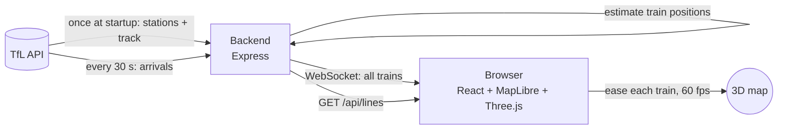
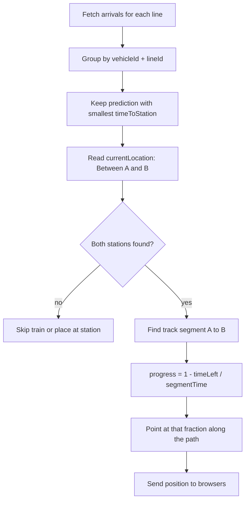
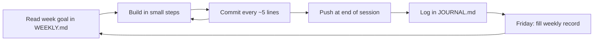
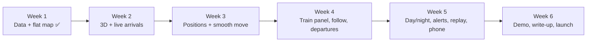

# Flowcharts

These render as diagrams on GitHub.

## 1. System flow

```mermaid
flowchart LR
    TFL[(TfL API)] -->|once at startup: stations + track| BE[Backend<br/>Express]
    TFL -->|every 30 s: arrivals| BE
    BE -->|estimate train positions| BE
    BE -->|WebSocket: all trains| FE[Browser<br/>React + MapLibre + Three.js]
    BE -->|GET /api/lines| FE
    FE -->|ease each train, 60 fps| MAP((3D map))
```

## 2. Train position estimate (every 30 s)

```mermaid
flowchart TD
    A[Fetch arrivals for each line] --> B[Group by vehicleId + lineId]
    B --> C[Keep prediction with smallest timeToStation]
    C --> D[Read currentLocation: Between A and B]
    D --> E{Both stations found?}
    E -- no --> F[Skip train or place at station]
    E -- yes --> G[Find track segment A to B]
    G --> H[progress = 1 - timeLeft / segmentTime]
    H --> I[Point at that fraction along the path]
    I --> J[Send position to browsers]
```

## 3. Weekly work cycle

```mermaid
flowchart LR
    G[Read week goal in WEEKLY.md] --> B[Build in small steps]
    B --> C[Commit every ~5 lines]
    C --> B
    C --> P[Push at end of session]
    P --> J[Log in JOURNAL.md]
    J --> R[Friday: fill weekly record]
    R --> G
```

## 4. Six-week plan

```mermaid
flowchart LR
    W1[Week 1<br/>Data + flat map ✅] --> W2[Week 2<br/>3D + live arrivals]
    W2 --> W3[Week 3<br/>Positions + smooth move]
    W3 --> W4[Week 4<br/>Train panel, follow, departures]
    W4 --> W5[Week 5<br/>Day/night, alerts, replay, phone]
    W5 --> W6[Week 6<br/>Demo, write-up, launch]
```
